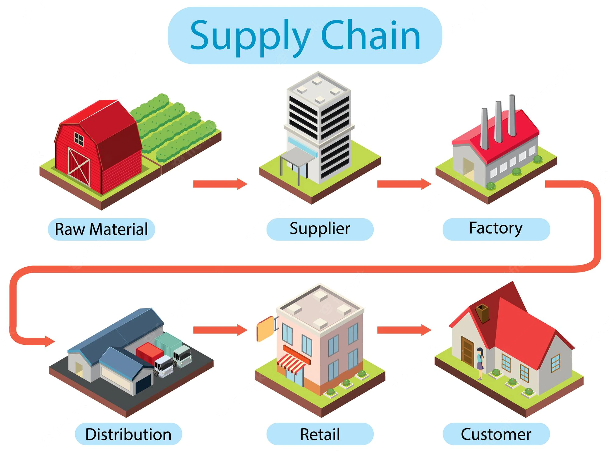

#### Introduction

Supply chain is the global network use dto deliver product and services from raw materials to end customers through an engineered flow of information,physical distribution and cash.

#### Goals of Supply chain

- Optimum usage of resource
- Create a streamlined process
- Eradicates Redundant efforts
- Reduce inventory level
- Minimize costs
- Save resources
- Meet customer demands
